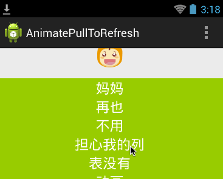

#AnimatePullToRefresh

这是一个各种下拉刷新动画的合集.项目是基于[chrisbanes的PullToRefresh](https://github.com/chrisbanes/Android-PullToRefresh)完成的。

#吃包子动画

一个变拉边吃的listview, 动画师由多张图片切换完成的，模仿“大众点评”
 
 
 
###使用方法

使用默认的chrisbanes的PullToRefresh即可.

#自定义GIF动画

使用自己的gif文件作为动画。

### 使用方法

分为下面两部：

1. 把gif文件放到asset文件夹下.
2. 配置xml文件，加入gif文件名.

```xml
    <com.handmark.pulltorefresh.library.PullToRefreshListView
        android:id="@+id/pull_to_refresh_listview"
        android:layout_height="fill_parent"
        android:layout_width="fill_parent"
        android:divider="@null"
        ptr:ptrAnimationStyle="gif"
        ptr:ptrMode="pullFromStart"
        ptr:ptrGifAsset="squirrel.gif"
        />
```
 
#TODO
    
添加更多动画